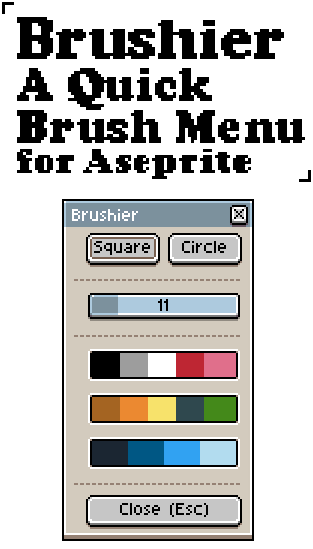
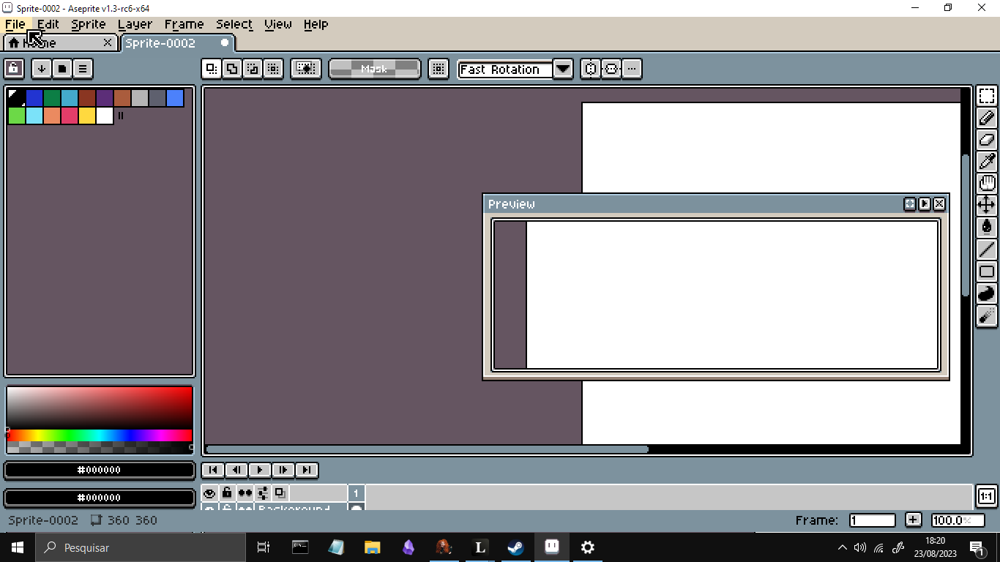
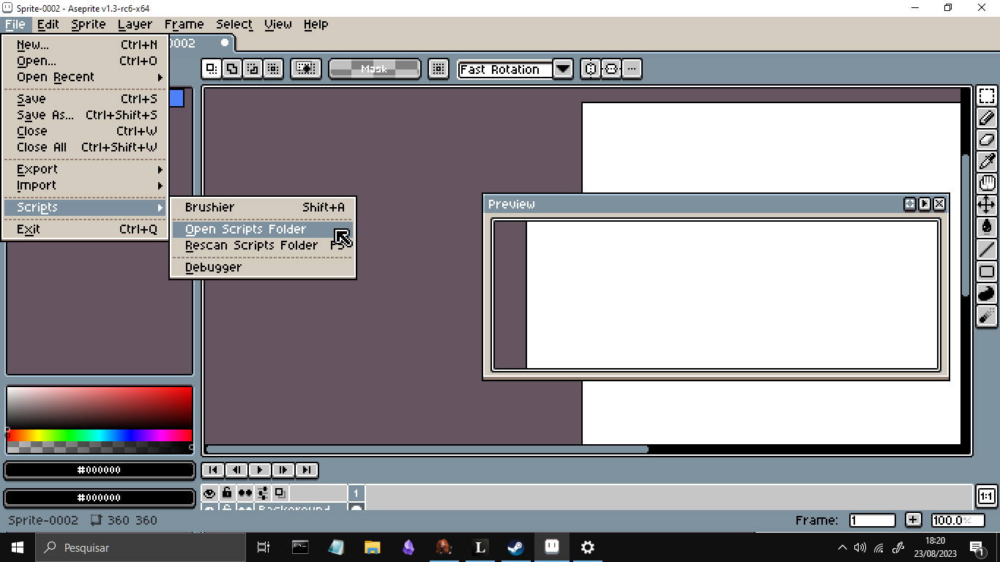
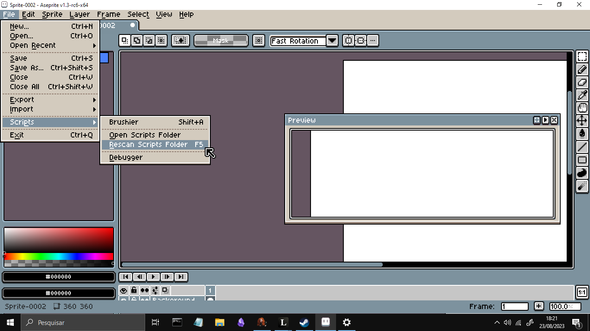
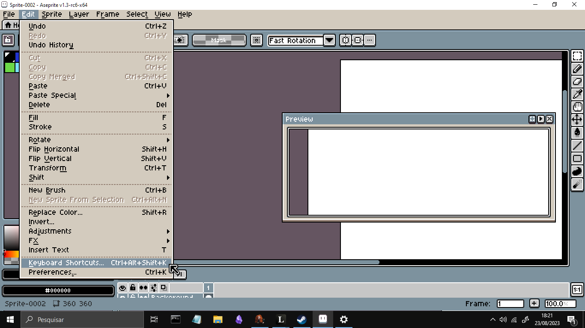
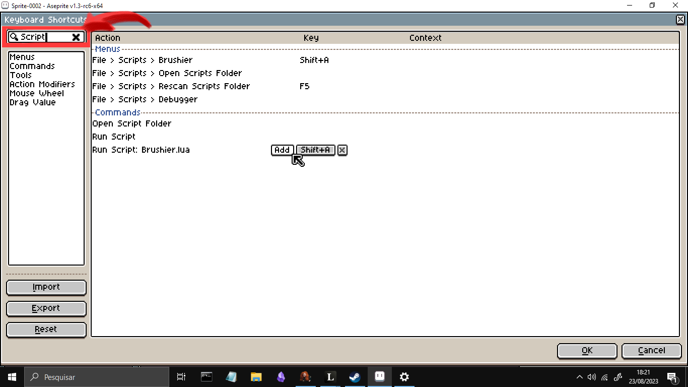
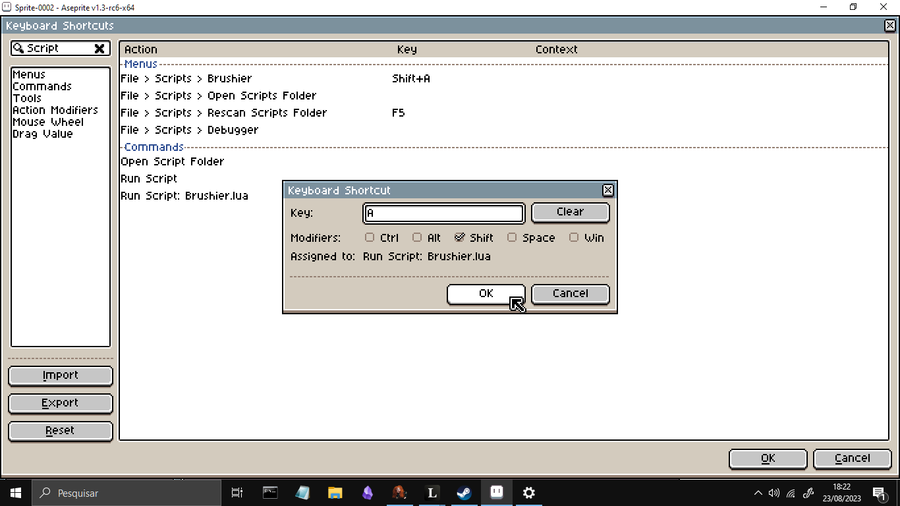
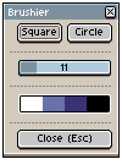
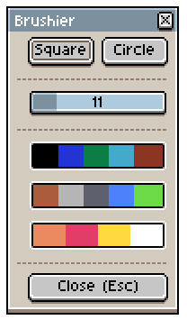

# Brushier

Brushier is a plugin for Aseprite that allows you to have a quick brush menu right at your mouse position. Brushier is an alternative to different shortcuts and allows you to change brush stuff without moving your mouse / pen too much.

## Features

1. Change Brush Type.
2. Change Brush Size.
3. Showcase current Palette and change FG color.

## Disclaimer

This script requires Aseprite v1.3-rc2 or greater.

## Installation

-   Click on File.

-   Open Scripts Folder and paste Brushier.lua file inside of it.

-   Rescan Scripts Folder (F5).

-   Go to Edit and select Keyboard Shortcuts.

-   Search for "Script" and click on "Add" (Key) at "Run Script: Brushier.lua" row.

-   I recommend you to use "Shift + A" but you can use any unused shortcut that you prefer.

-   Done! Now press Shift + A and Brushier will open.

## Examples of Brushier

## License

[MIT](https://choosealicense.com/licenses/mit/)
